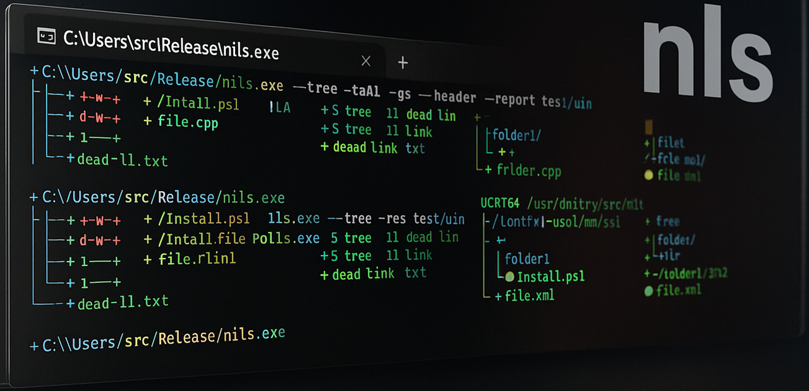
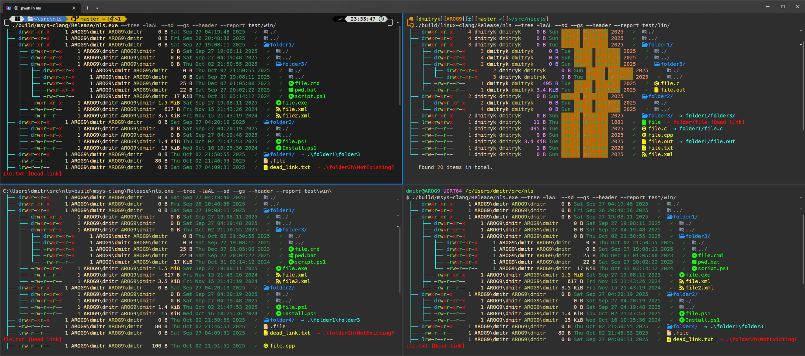
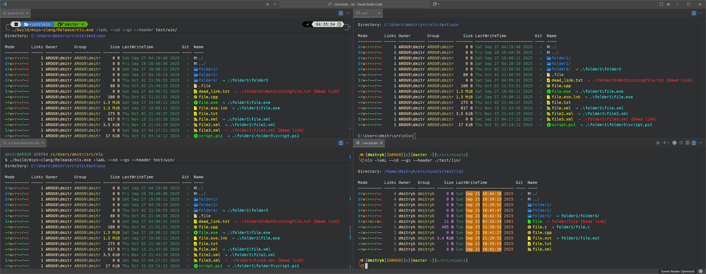
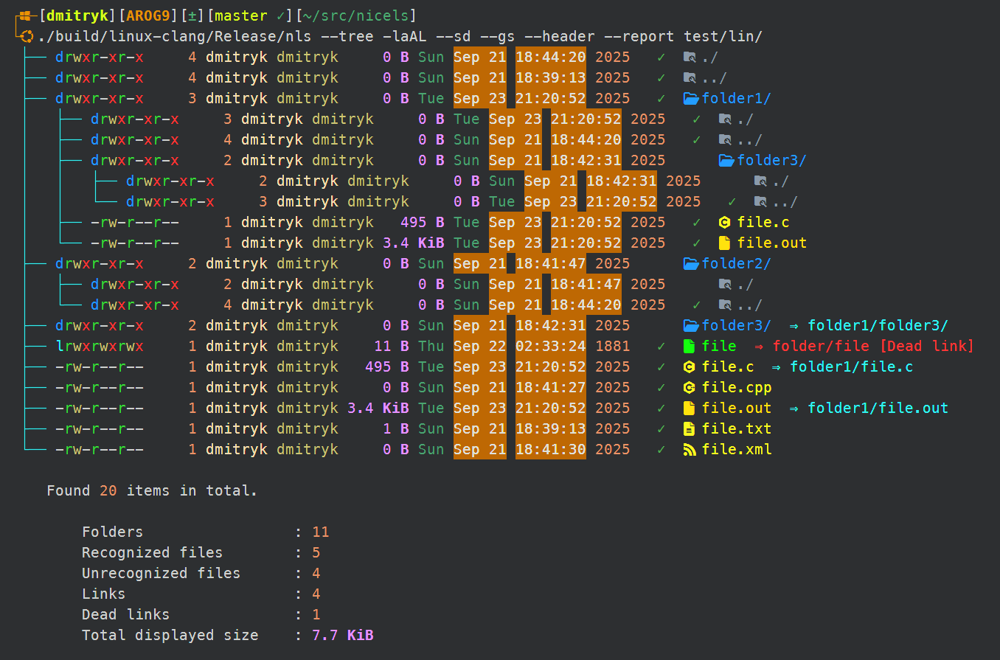
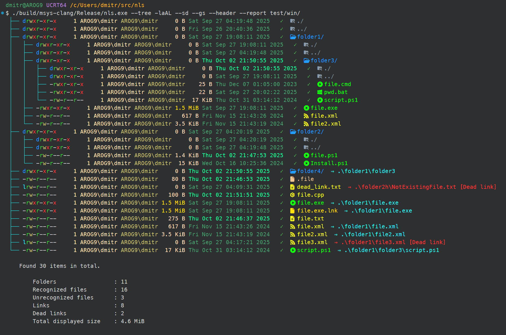
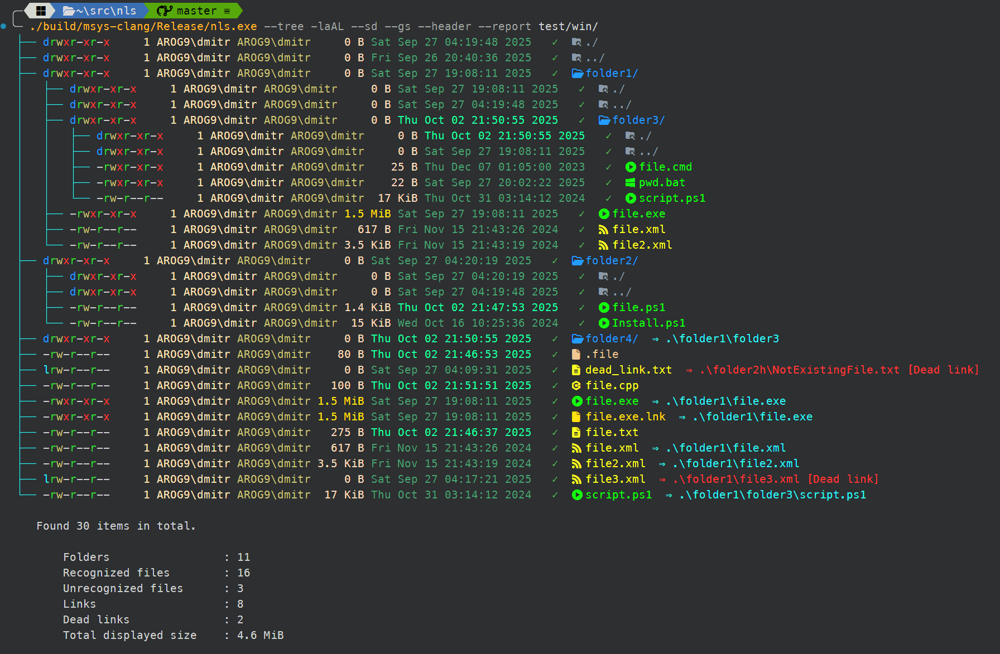
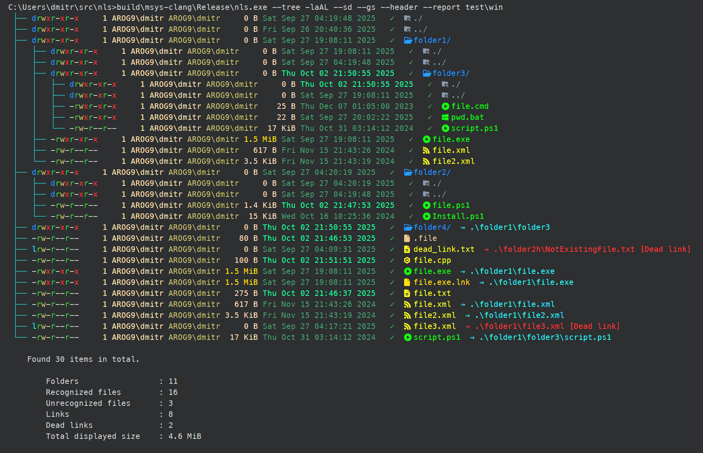

# nicels



## Project overview and goals
nicels is a modern, cross-platform reimagining of `ls` that emphasises rich,
customisable output, first-class Git awareness, and predictable builds. The
executable is implemented in ISO C++23, uses [CLI11](https://github.com/CLIUtils/CLI11)
for its command-line interface, and links against libgit2 when Git status
information is requested. Icons, colour themes, file metadata, and Git porce-
lain state can all be surfaced in a single listing, while CMake presets keep
builds reproducible across Linux and Windows (msys2,pwsh,cmd) targets.【F:CMakeLists.txt†L39-L122】【F:src/git_status.cpp†L1-L116】





## Installation
### Windows installer
Download the latest `nicels` setup program from the project's releases (or
generate one locally with `cpack -G NSIS`). The installer supports
per-machine and per-user installs, offers an "Add nls to PATH" checkbox, and
installs the bundled configuration database at `<install dir>\\DB\\NLS.sqlite3`. Restart any open
shells after installation so the updated PATH takes effect. User overrides are
still loaded from `%APPDATA%\\nicels\\DB\\NLS.sqlite3`, letting you keep local changes
separate from the shared defaults.【F:CMakeLists.txt†L206-L228】【F:cmake/NSIS/NicelsNSISTemplate.in†L809-L877】

### Linux packages

Download the appropriate archive from the releases page or generate packages
locally with CPack (see [Package (Linux)](#package-linux)).

**Debian / Ubuntu (`.deb`)**

```sh
sudo dpkg -i nicels_<version>_amd64.deb
# Resolve any missing dependencies reported by dpkg:
sudo apt-get install -f
```

This installs `nls` to `/usr/bin/nls` and places the default configuration
database at `/etc/dm17ryk/nicels/DB/NLS.sqlite3`. Future upgrades or downgrades can
reuse the same command; Debian's `conffile` handling preserves local edits in
`/etc` by prompting before overwriting.【F:CMakeLists.txt†L177-L231】【F:CMakeLists.txt†L232-L306】

**Fedora / RHEL (`.rpm`)**

```sh
sudo rpm -Uvh nicels-<version>-1.x86_64.rpm
# Or, with dnf:
sudo dnf install ./nicels-<version>-1.x86_64.rpm
```

The package installs the binary under `/usr/bin` and marks
`/etc/dm17ryk/nicels/DB/NLS.sqlite3` as `%config(noreplace)` so administrator
changes survive upgrades.【F:CMakeLists.txt†L232-L306】

**User-local install (no root)**

If you cannot use the system package manager, run the helper script to stage a
per-user installation:

```sh
./tools/install_nls_user.sh --binary /path/to/nls --db /path/to/NLS.sqlite3
```

The script copies the executable to `~/.local/bin/nls`, installs the default
database into `~/.nicels/DB`, and automatically backs up an existing
`~/.nicels/DB/NLS.sqlite3` file before replacing it. It prints a reminder if
`~/.local/bin` is not on your `PATH` and supports a `--dry-run` mode for
verification.【F:tools/install_nls_user.sh†L1-L184】

### Linux (build from source)
1. Install toolchain dependencies:
   ```sh
   sudo apt update
   sudo apt install git cmake ninja-build clang clang++ pkg-config libssl-dev
   ```
2. Clone the repository and fetch vendored dependencies:
   ```sh
   git clone https://github.com/dm17ryk/nicels.git
   cd nicels
   git submodule update --init --recursive
   ```

### Windows (MSYS2 UCRT)
1. Start a **UCRT64** shell and install the required packages:
   ```sh
   pacman -S --needed \
       git \
       mingw-w64-ucrt-x86_64-{git,cmake,clang,ninja,python,llvm,llvm-libs,lld,toolchain,nsis}
   ```
2. Clone the sources and initialise submodules:
   ```sh
   git clone https://github.com/dm17ryk/nicels.git
   cd nicels
   git submodule update --init --recursive
   ```

## Build, run, and test
The project ships CMake presets for single- and multi-config generators.
Configure once, then build whichever configuration you need.【F:BUILD_README.md†L18-L66】

### Configure
```sh
# Linux
cmake --preset linux-clang

# Windows / MSYS2 UCRT
cmake --preset msys-clang
```

### Build
```sh
# Linux
cmake --build --preset linux-clang-release
cmake --build --preset linux-clang-debug

# Windows / MSYS2 UCRT
cmake --build --preset msys-clang-release
cmake --build --preset msys-clang-debug
```

#### Package (Windows)
After building the release configuration, create the installer with CPack:

```sh
cmake --build --preset msys-clang-release
cpack -G NSIS --config build/msys-clang/CPackConfig.cmake
```
The resulting `.exe` sits next to the build tree inside `build/msys-clang`.

#### Package (Linux)
Build the release binaries, then ask CPack for the DEB, RPM, and source
archives:

```sh
cmake --build --preset linux-clang-release
cpack -G DEB -G RPM --config build/linux-clang/CPackConfig.cmake
cpack -G TGZ --config build/linux-clang/CPackSourceConfig.cmake
```

The generated files appear in `build/linux-clang/` under names such as
`nicels-<version>-<arch>.deb`, `nicels-<version>-<arch>.rpm`, and
`nicels-<version>-Source.tar.gz`. Debian and RPM archives adopt architecture
tags like `x86_64`, `aarch64`, `x86`, or `arm` depending on the target. Debian
packages automatically derive shared library dependencies with
`dpkg-shlibdeps`, and the RPM marks the SQLite database as `%config(noreplace)` so
upgrades respect local edits.【F:CMakeLists.txt†L177-L328】

The `nls` executable appears under `build/<preset>/<config>/`. Run it directly
from the build tree or after `cmake --install` to stage an install tree under
`build/<preset>/install/`.【F:BUILD_README.md†L68-L118】

## Versioning

nls follows a four-component version scheme: `major.minor[.maintenance[.build]]`.
The canonical version is stored in the repository's `VERSION` file and surfaced
via `nls --version` at runtime.【F:VERSION†L1-L1】【F:src/command_line_parser.cpp†L413-L443】

* **Major/minor** numbers are updated manually whenever a breaking or notable
  change warrants it.
* **Maintenance** increments automatically after each pull request merge. The
  helper script `tools/update_version.py --bump-maintenance` applies the bump
  and resets the build counter.【F:tools/update_version.py†L1-L169】
* **Build** increments on release builds that ship new code. Use
  `tools/update_version.py --bump-build` and provide `--compare-ref <ref>` to
  guard against unintended bumps when no changes occurred compared to the
  previous release reference.【F:tools/update_version.py†L1-L169】

Both bump operations print the resulting version and rewrite `VERSION` unless
`--dry-run` is specified. The script enforces non-negative values and ensures
the file always contains four components, starting at `1.0.0.0`.

### Run
```sh
./build/linux-clang/Release/nls --help
./build/msys-clang/Release/nls.exe -laA
```

### Tests
CTest presets are provided even though no tests are defined yet:
```sh
ctest --preset linux-clang-test
ctest --preset msys-clang-test
```
You will see the informational message from CMake until tests are added.【F:CMakeLists.txt†L159-L170】

## Configuration files and themes
`nls` loads its colour themes, icon maps, and aliases from the SQLite
database `NLS.sqlite3`. At startup it searches for the database in this order:

1. A directory specified via the `NLS_DATA_DIR` environment variable (highest priority).
2. `./DB/` relative to the current working directory (and the working directory itself).
3. `DB/` next to the executable, the executable's directory, and their parents (for relocatable installs).
4. System-wide defaults installed with the package, e.g. `/etc/dm17ryk/nicels/DB/NLS.sqlite3` on Linux or `%PROGRAMDATA%\nicels\DB\NLS.sqlite3` on Windows.
5. Per-user overrides: `~/.nicels/DB/NLS.sqlite3` on Linux/macOS, or `%APPDATA%\nicels\DB\NLS.sqlite3` on Windows (falling back to `%USERPROFILE%\nicels\DB` if `%APPDATA%` is unavailable).

The first readable database found in that order is used. If none can be opened,
nicels falls back to the compiled-in defaults.【F:src/resources.cpp†L9-L207】【F:src/theme.cpp†L421-L515】

To customise colours or icons, copy the packaged `NLS.sqlite3` into the user
configuration directory and edit it with your preferred SQLite tooling. Because
the configuration lives in a single file, overrides replace the entire
database—copy the default, modify it, and place the customised version wherever
you want it to apply (e.g. `~/.nicels/DB/NLS.sqlite3`). The `--copy-config`
and `--copy-config-only` options copy the currently detected database into the
user directory for convenience.

## CLI usage
### Quick start
`nls` mirrors the GNU `ls` workflow. Listing the current directory with Git
status and icons enabled looks like:
```sh
nls -laA --gs --header --report=long
```
Use `--color=auto` (default) to keep ANSI colours only when stdout is a
terminal, and `--no-icons` when running inside tools that strip Unicode.

### Keeping this section in sync
The CLI reference below is generated from the live binary. After changing
options in `src/command_line_parser.cpp`, rebuild `nls` and run:
```sh
python ./tools/update_cli_reference.py ./build/msys-clang/Release/nls.exe
```
Paste the output into the README to keep the documentation in lock-step with
what the executable reports.

#### Positionals

| Option(s) | Argument | Default | Description |
| --- | --- | --- | --- |
| `paths` | `PATH ...` | `—` | paths to list |

#### General

| Option(s) | Argument | Default | Description |
| --- | --- | --- | --- |
| `-h, --help` | `—` | `—` | Print this help message and exit |
| `--version` | `—` | `—` | Display program version information and exit |
| `--copy-config` | `—` | `—` | copy default configuration files to the user configuration directory and exit |

#### Layout options

| Option(s) | Argument | Default | Description |
| --- | --- | --- | --- |
| `-l, --long` | `—` | `—` | use a long listing format |
| `-1, --one-per-line` | `—` | `—` | list one file per line |
| `-x` | `—` | `—` | list entries by lines instead of by columns |
| `-C` | `—` | `—` | list entries by columns instead of by lines |
| `--format` | `WORD` | `vertical` | use format: across (-x), horizontal (-x), long (-l), single-column (-1), vertical (-C) or comma (-m) (default: vertical) |
| `--header` | `—` | `—` | print directory header and column names in long listing |
| `-m` | `—` | `—` | fill width with a comma separated list of entries |
| `-T, --tabsize` | `COLS` | `—` | assume tab stops at each COLS instead of 8 |
| `-w, --width` | `COLS` | `—` | set output width to COLS. 0 means no limit |
| `--tree{0}` | `—` | `=DEPTH` | show tree view of directories, optionally limited to DEPTH (0 for unlimited) |
| `--report{long}` | `—` | `=WORD` | show summary report: short, long (default: long) |
| `--zero` | `—` | `—` | end each output line with NUL, not newline |

#### Filtering options

| Option(s) | Argument | Default | Description |
| --- | --- | --- | --- |
| `-a, --all` | `—` | `—` | do not ignore entries starting with . |
| `-A, --almost-all` | `—` | `—` | do not list . and .. |
| `-d, --dirs` | `—` | `—` | show only directories |
| `-f, --files` | `—` | `—` | show only files |
| `-B, --ignore-backups` | `—` | `—` | do not list implied entries ending with ~ |
| `--hide` | `PATTERN ...` | `—` | do not list implied entries matching shell PATTERN (overridden by -a or -A) |
| `-I, --ignore` | `PATTERN ...` | `—` | do not list implied entries matching shell PATTERN |

#### Sorting options

| Option(s) | Argument | Default | Description |
| --- | --- | --- | --- |
| `-t` | `—` | `—` | sort by modification time, newest first |
| `-S` | `—` | `—` | sort by file size, largest first |
| `-X` | `—` | `—` | sort by file extension |
| `-U` | `—` | `—` | do not sort; list entries in directory order |
| `-r, --reverse` | `—` | `—` | reverse order while sorting |
| `--sort` | `WORD` | `name` | sort by WORD instead of name: none, size, time, extension (default: name) |
| `--sd, --sort-dirs, --group-directories-first` | `—` | `—` | sort directories before files |
| `--sf, --sort-files` | `—` | `—` | sort files first |
| `--df, --dots-first` | `—` | `—` | sort dot-files and dot-folders first |

#### Appearance options

| Option(s) | Argument | Default | Description |
| --- | --- | --- | --- |
| `-b, --escape` | `—` | `—` | print C-style escapes for nongraphic characters |
| `-N, --literal` | `—` | `—` | print entry names without quoting |
| `-Q, --quote-name` | `—` | `—` | enclose entry names in double quotes |
| `--quoting-style` | `WORD` | `literal` | use quoting style WORD for entry names: literal, locale, shell, shell-always, shell-escape, shell-escape-always, c, escape (default: literal) |
| `-p` | `—` | `—` | append / indicator to directories |
| `--indicator-style` | `STYLE` | `slash` | append indicator with style STYLE to entry names: none, slash (-p) (default: slash) |
| `--no-icons, --without-icons` | `—` | `—` | disable icons in output |
| `--no-color` | `—` | `—` | disable ANSI colors |
| `--color` | `WHEN` | `auto` | colorize the output: auto, always, never (default: auto) |
| `--theme` | `NAME` | `—` | use theme NAME from the configuration database |
| `--light` | `—` | `—` | use light color scheme |
| `--dark` | `—` | `—` | use dark color scheme |
| `-q, --hide-control-chars` | `—` | `—` | print ? instead of nongraphic characters |
| `--show-control-chars` | `—` | `—` | show nongraphic characters as-is |
| `--time-style` | `FORMAT` | `local` | use time display format: default, locale, local, long-iso, full-iso, iso, iso8601, FORMAT (default: local) |
| `--full-time` | `—` | `—` | like -l --time-style=full-iso |
| `--hyperlink` | `—` | `—` | emit hyperlinks for entries |

#### Information options

| Option(s) | Argument | Default | Description |
| --- | --- | --- | --- |
| `-i, --inode` | `—` | `—` | show inode number |
| `-o` | `—` | `—` | use a long listing format without group information |
| `-g` | `—` | `—` | use a long listing format without owner information |
| `-G, --no-group` | `—` | `—` | show no group information in a long listing |
| `-n, --numeric-uid-gid` | `—` | `—` | like -l, but list numeric user and group IDs |
| `--bytes, --non-human-readable` | `—` | `—` | show file sizes in bytes |
| `-s, --size` | `—` | `—` | print the allocated size of each file, in blocks |
| `--block-size` | `SIZE` | `—` | with -l, scale sizes by SIZE when printing them |
| `-L, --dereference` | `—` | `—` | when showing file information for a symbolic link, show information for the file the link references |
| `--gs, --git-status` | `—` | `—` | show git status for each file |

#### Debug options

| Option(s) | Argument | Default | Description |
| --- | --- | --- | --- |
| `--perf-debug` | `—` | `—` | enable performance diagnostics |

**Footnotes and related behaviour**
- `SIZE` accepts optional binary (K, M, …) or decimal (KB, MB, …) suffixes.
- `TIME_STYLE` values mirror `date(1)` and honour the `TIME_STYLE` environment variable.
- `WHEN` defaults to `always`; set `LS_COLORS` or `dircolors(1)` to refine colour palettes.
- Exit status: `0` (success), `1` (minor issues), `2` (serious trouble).
- Related commands: `date(1)` and `dircolors(1)`.

## Performance notes and Git status tuning
- `--gs/--git-status` delegates to libgit2. Disable it for large trees or build
  without libgit2 by configuring with `-DNLS_ENABLE_LIBGIT2=OFF`.
- Long listings render faster with `--no-icons`, `--color=never`, or a narrower
  `--report short` summary when scripting.
- On Windows presets, the link options statically link libgcc/libstdc++/winpthread
  so the produced `nls.exe` is self-contained.【F:CMakeLists.txt†L109-L149】
- Configuration data lives in `NLS.sqlite3`. Copy it into `~/.nicels/DB` (or
  `%APPDATA%\nicels\DB` on Windows) to experiment with new colours, icons, or
  aliases without modifying the system-wide database.

## ASCII screenshots
### Linux (ANSI colours with inode, owner/group, Git status)
```
Directory: ␛[38;2;65;105;225m/workspace/nicels␛[0m

␛[38;2;211;211;211m  Inode␛[0m ␛[38;2;211;211;211mMode      ␛[0m ␛[38;2;211;211;211mLinks␛[0m ␛[38;2;211;211;211mOwner␛[0m ␛[38;2;211;211;211mGroup␛[0m ␛[38;2;211;211;211m   Size␛[0m ␛[38;2;211;211;211mLastWriteTime           ␛[0m ␛[38;2;211;211;211mGit␛[0m ␛[38;2;211;211;211mName␛[0m
------- ---------- ----- ----- ----- ------- ------------------------ --- ----
␛[38;2;255;228;181m1441818␛[0m ␛[38;2;30;144;255md␛[0m␛[38;2;50;205;50mr␛[0m␛[38;2;189;183;107mw␛[0m␛[38;2;255;0;0mx␛[0m␛[38;2;50;205;50mr␛[0m-␛[38;2;255;0;0mx␛[0m␛[38;2;50;205;50mr␛[0m-␛[38;2;255;0;0mx␛[0m ␛[38;2;255;228;181m    5␛[0m ␛[38;2;255;228;181mroot ␛[0m ␛[38;2;189;183;107mroot ␛[0m ␛[38;2;255;218;185m    0 B␛[0m ␛[38;2;0;255;0mSat Sep 27 23:19:06 2025␛[0m     ␛[38;2;30;144;255mbuild/␛[0m
␛[38;2;255;228;181m1442005␛[0m -␛[38;2;50;205;50mr␛[0m␛[38;2;189;183;107mw␛[0m-␛[38;2;50;205;50mr␛[0m--␛[38;2;50;205;50mr␛[0m-- ␛[38;2;255;228;181m    1␛[0m ␛[38;2;255;228;181mroot ␛[0m ␛[38;2;189;183;107mroot ␛[0m ␛[38;2;255;218;185m3.5 KiB␛[0m ␛[38;2;0;255;0mSat Sep 27 23:17:05 2025␛[0m     ␛[38;2;255;255;0mBUILD_README.md␛[0m
```
### Linux (bash example)


### Windows (MSYS2 UCRT example)


### Windows (PowerShell example)


### Windows (cmd example)


## Packaging and artifacts
Binary packaging is not configured yet. Use `cmake --install` to stage files for
archiving or distribution; the install target copies headers to
`include/nls/` and the executable to `bin/`.【F:CMakeLists.txt†L151-L156】
